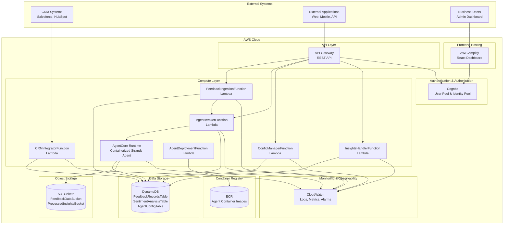
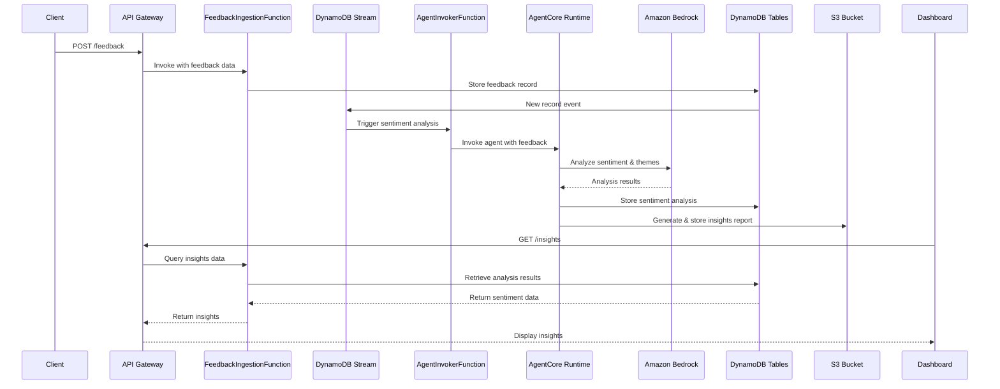

# InsightModAI Agent

[](https://aws.amazon.com/serverless/)
[](https://aws.amazon.com/bedrock/)
[](https://reactjs.org/)
[](https://www.python.org/)
[](https://mui.com/)
[](https://fastapi.tiangolo.com/)
[](https://aws.amazon.com/dynamodb/)
[](https://github.com/features/actions)
[](https://www.docker.com/)
[](https://creativecommons.org/licenses/by-nc/4.0/)

## Autonomous AI Agent for Customer Insights Analysis

InsightModAI Agent is a serverless, autonomous AI system that processes customer feedback, analyzes sentiment, identifies themes, and generates actionable business insights. Built entirely on AWS using Amazon Bedrock AgentCore Runtime, it automates customer insights workflows with enterprise-grade security, monitoring, and reliability.

## Key Features

- **Autonomous Processing**: Automatically processes customer feedback using advanced AI models for sentiment analysis and theme extraction
- **Real-time Insights**: Extracts themes, validates sentiment, and generates actionable reports in real-time
- **CRM Integration**: Optional integration with Salesforce, HubSpot, and other CRM systems
- **Visual Dashboard**: React-based admin interface for monitoring, configuration, and insights visualization
- **Enterprise Security**: AWS Cognito authentication with least-privilege IAM roles and comprehensive audit logging
- **Comprehensive Monitoring**: CloudWatch monitoring, alerting, and observability across all components
- **Cost Optimized**: Serverless architecture with pay-per-use pricing and automatic scaling

## Architecture

### High-Level System Architecture



### Core Components

#### AI & Processing Layer
- **Amazon Bedrock AgentCore Runtime**: Containerized Strands agent framework for autonomous AI processing
- **Strands Agent**: Python-based agent with tool decorators for sentiment analysis, data storage, and CRM integration
- **Bedrock Models**: Claude 3.5 Sonnet, Titan Text Premier, and Nova Pro for advanced language processing

#### Serverless Compute
- **FeedbackIngestionFunction**: Processes API/S3 feedback submissions and triggers agent processing
- **AgentInvokerFunction**: Invokes AgentCore Runtime with sentiment analysis requests
- **CRMIntegratorFunction**: Handles CRM API integrations (Salesforce, HubSpot)
- **ConfigManagerFunction**: Manages system configuration and agent settings
- **InsightsHandlerFunction**: Processes and serves insights data to dashboards
- **AgentDeploymentFunction**: Custom resource for AgentCore Runtime lifecycle management

#### Data Storage Layer
- **FeedbackRecordsTable**: Stores raw customer feedback with customer_id, timestamp, and channel metadata
- **SentimentAnalysisTable**: Stores processed sentiment scores, themes, and analysis results
- **AgentConfigTable**: Stores system configuration including CRM settings and agent parameters

#### Object Storage
- **FeedbackDataBucket**: Raw feedback files and bulk data uploads
- **ProcessedInsightsBucket**: Generated reports, analysis results, and insights data

#### API & Integration
- **API Gateway**: REST API with endpoints for feedback submission, insights retrieval, agent invocation, and configuration management
- **AWS Amplify**: React dashboard hosting with automatic builds and global CDN distribution

#### Security & Identity
- **Cognito User Pool**: Email-based authentication for admin users with MFA support
- **Cognito Identity Pool**: AWS credential vending for authenticated dashboard access
- **IAM Roles**: Least-privilege policies for all Lambda functions and AgentCore Runtime

#### Monitoring & Observability
- **CloudWatch Logs**: Centralized logging for all Lambda functions and agent operations
- **CloudWatch Metrics**: Custom business metrics for feedback volume, sentiment trends, and processing rates
- **CloudWatch Alarms**: Automated alerts for sentiment drops, processing failures, and system errors

### Data Flow Architecture



## Quick Start

### Prerequisites

#### Required Tools
- **AWS Account**: With administrator access and Bedrock enabled in supported regions (us-west-2, eu-west-1)
- **Node.js**: Version 18+ for React dashboard development and building
- **Python**: Version 3.11+ for agent development and testing
- **AWS CLI**: Version 2.0+ configured with credentials
- **Docker**: For containerizing the Strands agent
- **Git**: For version control and GitHub Actions deployment

#### AWS Permissions
The deployment requires these AWS permissions:
- CloudFormation: Create, update, and delete stacks
- Lambda: Create and manage functions
- DynamoDB: Create tables and manage data
- S3: Create buckets and manage objects
- API Gateway: Create and manage REST APIs
- Cognito: Manage user pools and identity pools
- Amplify: Create and manage apps
- Bedrock: Access AgentCore Runtime and foundation models
- ECR: Manage container repositories
- IAM: Create roles and policies

### Deployment Options

#### Automated Deployment (Recommended)

The project includes a comprehensive GitHub Actions CI/CD pipeline for automated deployment.

##### Setup Steps

1. **Configure AWS OIDC Provider**
   Follow the detailed instructions in `docs/OIDC-SETUP.md` to set up GitHub OIDC authentication in your AWS account.

2. **Configure GitHub Repository Secrets**
   Add these secrets to your GitHub repository settings:
   - `AWS_ACCESS_KEY_ID`: AWS access key ID
   - `AWS_SECRET_ACCESS_KEY`: AWS secret access key
   - `AWS_ACCOUNT_ID`: Your 12-digit AWS account ID

3. **Deploy via GitHub Actions**
   ```bash
   # Clone the repository
   git clone https://github.com/your-org/InsightModAI.git
   cd InsightModAI

   # Push to trigger automated deployment
   git push origin main
   ```

4. **Monitor Deployment**
   - Go to the Actions tab in your GitHub repository
   - Select "Deploy InsightModAI Agent" workflow
   - Monitor the deployment progress and logs

##### Environment-Specific Deployment

You can manually trigger deployments to specific environments:
- Go to Actions → Deploy InsightModAI Agent → Run workflow
- Select environment: `dev`, `staging`, or `prod`
- Choose action: `deploy`, `destroy`, or `validate`

#### Manual Deployment

For manual deployment without GitHub Actions:

```bash
# 1. Clone the repository
git clone https://github.com/your-org/InsightModAI.git
cd InsightModAI

# 2. Build the frontend
cd frontend
npm install
npm run build
cd ..

# 3. Build the agent container
cd agent
docker build -t insightmodai-agent:latest .
cd ..

# 4. Deploy CloudFormation stack
aws cloudformation create-stack \
  --stack-name insightmodai-agent-prod \
  --template-body file://cloudformation/template.yaml \
  --parameters \
    ParameterKey=AdminEmail,ParameterValue=admin@yourcompany.com \
    ParameterKey=BedrockModelId,ParameterValue=us.anthropic.claude-3-5-sonnet-20241022-v2:0 \
    ParameterKey=EnvironmentName,ParameterValue=prod \
    ParameterKey=EnableCRM,ParameterValue=false \
    ParameterKey=CognitoDomainName,ParameterValue=insightmodai-prod-$(openssl rand -hex 4) \
  --capabilities CAPABILITY_IAM CAPABILITY_AUTO_EXPAND \
  --region us-west-2

# 5. Wait for deployment completion
aws cloudformation wait stack-create-complete \
  --stack-name insightmodai-agent-prod \
  --region us-west-2

# 6. Get deployment outputs
aws cloudformation describe-stacks \
  --stack-name insightmodai-agent-prod \
  --query 'Stacks[0].Outputs' \
  --output table \
  --region us-west-2
```

#### Post-Deployment Setup

1. **Create Admin User**
   ```bash
   # Get User Pool ID from stack outputs
   USER_POOL_ID=$(aws cloudformation describe-stacks \
     --stack-name insightmodai-agent-prod \
     --query 'Stacks[0].Outputs[?OutputKey==`UserPoolId`].OutputValue' \
     --output text --region us-west-2)

   # Create admin user
   aws cognito-idp admin-create-user \
     --user-pool-id $USER_POOL_ID \
     --username admin@yourcompany.com \
     --user-attributes Name=email,Value=admin@yourcompany.com Name=email_verified,Value=true \
     --temporary-password TempPass123! \
     --message-action SUPPRESS \
     --region us-west-2
   ```

2. **Set Permanent Password**
   - Open the Amplify dashboard URL from stack outputs
   - Sign in with email `admin@yourcompany.com` and temporary password `TempPass123!`
   - Set a permanent password (minimum 8 characters, mixed case, numbers, symbols)

3. **Verify Deployment**
   - Access the React dashboard URL
   - Submit test feedback via the API
   - Verify sentiment analysis and insights generation

## Usage Examples

### API Endpoints

The system provides a REST API for feedback submission, insights retrieval, and system management. All authenticated endpoints require AWS IAM or Cognito JWT tokens.

#### 1. Submit Customer Feedback

```bash
# Submit feedback via API Gateway
curl -X POST https://your-api-id.execute-api.us-west-2.amazonaws.com/prod/feedback \
  -H "Content-Type: application/json" \
  -d '{
    "customer_id": "customer_12345",
    "feedback_text": "Excellent service! The team was very helpful and resolved my issue quickly. Highly recommended!",
    "channel": "email",
    "rating": 5,
    "metadata": {
      "category": "support",
      "priority": "high",
      "tags": ["positive", "resolution"]
    }
  }'

# Response
{
  "feedback_id": "fb_12345678-1234-1234-1234-123456789abc",
  "status": "processed",
  "timestamp": "2024-10-22T15:30:00Z",
  "message": "Feedback submitted successfully"
}
```

#### 2. Retrieve Sentiment Insights

```bash
# Get sentiment analysis results (requires authentication)
curl -X GET "https://your-api-id.execute-api.us-west-2.amazonaws.com/prod/insights?customer_id=customer_12345&limit=10" \
  -H "Authorization: AWS4-HMAC-SHA256 Credential=YOUR_CREDENTIALS"

# Response
{
  "insights": [
    {
      "feedback_id": "fb_12345678-1234-1234-1234-123456789abc",
      "customer_id": "customer_12345",
      "sentiment_score": 0.89,
      "sentiment_label": "positive",
      "confidence": 0.92,
      "key_themes": ["service_quality", "resolution_time", "helpfulness"],
      "analysis_timestamp": "2024-10-22T15:30:05Z"
    }
  ],
  "total_count": 1,
  "average_sentiment": 0.89
}
```

#### 3. Query Sentiment Trends

```bash
# Get sentiment trends over time (requires authentication)
curl -X GET "https://your-api-id.execute-api.us-west-2.amazonaws.com/prod/insights/trends?timeframe=30d" \
  -H "Authorization: AWS4-HMAC-SHA256 Credential=YOUR_CREDENTIALS"

# Response
{
  "timeframe": "30d",
  "total_analyses": 150,
  "average_sentiment": 0.72,
  "trend": "improving",
  "sentiment_distribution": {
    "positive": 95,
    "neutral": 35,
    "negative": 20
  },
  "recommendations": [
    "Sentiment is improving. Continue current positive practices.",
    "Monitor the 20 negative feedback items for common issues."
  ]
}
```

#### 4. Direct Agent Invocation

```bash
# Invoke the AI agent directly (requires authentication)
curl -X POST https://your-api-id.execute-api.us-west-2.amazonaws.com/prod/agent \
  -H "Content-Type: application/json" \
  -H "Authorization: AWS4-HMAC-SHA256 Credential=YOUR_CREDENTIALS" \
  -d '{
    "prompt": "Analyze this customer feedback and provide insights: The product is good but the setup process was confusing.",
    "customer_id": "customer_12345",
    "context": {
      "previous_interactions": 3,
      "customer_segment": "enterprise"
    }
  }'

# Response
{
  "response": "Based on the customer feedback, the product quality is rated positively, but there are usability concerns with the setup process. Key themes identified: product_quality (positive), setup_complexity (negative). Recommendations: Improve setup documentation and consider a guided setup wizard.",
  "session_id": "sess_87654321-4321-4321-4321-987654321cba",
  "customer_id": "customer_12345",
  "timestamp": "2024-10-22T15:30:10Z",
  "model_used": "us.anthropic.claude-3-5-sonnet-20241022-v2:0",
  "tools_used": ["analyze_sentiment", "query_sentiment_trends"],
  "memory_enabled": true
}
```

#### 5. System Configuration

```bash
# Get current configuration (requires authentication)
curl -X GET https://your-api-id.execute-api.us-west-2.amazonaws.com/prod/config \
  -H "Authorization: AWS4-HMAC-SHA256 Credential=YOUR_CREDENTIALS"

# Update configuration (requires authentication)
curl -X PUT https://your-api-id.execute-api.us-west-2.amazonaws.com/prod/config \
  -H "Content-Type: application/json" \
  -H "Authorization: AWS4-HMAC-SHA256 Credential=YOUR_CREDENTIALS" \
  -d '{
    "sentiment_threshold": 0.7,
    "theme_extraction_enabled": true,
    "auto_report_generation": true,
    "crm_integration": {
      "enabled": false,
      "provider": "salesforce",
      "sync_interval": "hourly"
    },
    "notification_preferences": {
      "negative_sentiment_alert": true,
      "threshold": -0.3,
      "email_recipients": ["admin@company.com"]
    }
  }'
```

### Dashboard Usage

The React dashboard provides a comprehensive interface for monitoring and managing the system.

#### Navigation Structure
- **Dashboard**: Real-time metrics, sentiment trends, and key insights
- **Modules**: Control agent modules (CRM integration, memory, reporting)
- **Observability**: System monitoring, logs, and performance metrics
- **Monitoring**: CloudWatch integration and alerting configuration
- **Memory Viewer**: Agent conversation history and semantic memory

#### Key Dashboard Features
- **Real-time Sentiment Visualization**: Charts showing sentiment trends over time
- **Feedback Processing Queue**: Live view of feedback being processed
- **Customer Insights**: Individual customer sentiment history and patterns
- **Report Generation**: Automated and manual report creation
- **System Health**: Lambda function performance and error monitoring

### Agent Capabilities

The Strands agent provides these core capabilities:

#### Sentiment Analysis Tools
- **analyze_sentiment**: Analyzes text for sentiment score, label, confidence, and themes
- **store_feedback**: Persists feedback data in DynamoDB with proper indexing
- **query_sentiment_trends**: Aggregates sentiment data over specified timeframes

#### Business Intelligence Tools
- **generate_report**: Creates comprehensive insights reports with recommendations
- **call_crm_api**: Integrates with Salesforce and HubSpot for customer data enrichment

#### Memory and Context
- **AgentCore Memory**: Maintains conversation context across customer interactions
- **Session Management**: Tracks conversation history and customer preferences
- **Semantic Search**: Retrieves relevant historical insights and patterns

## Technology Stack

### AI & Machine Learning
- **Amazon Bedrock**: Foundation model service providing access to Claude 3.5 Sonnet, Titan Text Premier, and Nova Pro
- **AgentCore Runtime**: AWS-managed container runtime for Strands agent execution
- **Strands Framework**: Python-based agent framework with tool decorators and memory management
- **Bedrock Models**: Multiple model support (Claude 3.5 Sonnet, Titan Text Premier, Nova Pro) for sentiment analysis

### Backend & Compute
- **AWS Lambda**: Serverless functions in Python 3.11 with 256MB to 512MB memory allocation
- **Amazon API Gateway**: REST API with CORS support, IAM authentication, and request/response mapping
- **Amazon DynamoDB**: NoSQL database with on-demand billing and global secondary indexes
- **Amazon S3**: Object storage with versioning, lifecycle policies, and Intelligent Tiering

### Frontend & User Interface
- **React 18**: Modern React application with hooks and functional components
- **Material-UI**: Component library with custom theming and responsive design
- **AWS Amplify**: React app hosting with automatic builds, CDN distribution, and environment management
- **React Router**: Client-side routing for dashboard navigation
- **Recharts**: Data visualization library for sentiment trends and metrics
- **React Query**: Data fetching and caching for API interactions

### Security & Identity
- **Amazon Cognito**: User authentication with hosted UI, MFA support, and JWT tokens
- **AWS IAM**: Least-privilege policies for all AWS resources and services
- **API Gateway Authorizers**: Request validation and authentication enforcement

### DevOps & Infrastructure
- **AWS CloudFormation**: Infrastructure as Code with nested stacks and parameter management
- **GitHub Actions**: CI/CD pipeline with automated testing, building, and deployment
- **Amazon ECR**: Private container registry for agent runtime images
- **AWS Systems Manager**: Parameter Store for configuration management

### Monitoring & Observability
- **Amazon CloudWatch**: Centralized logging, metrics, alarms, and custom dashboards
- **CloudWatch Logs**: Structured logging for all Lambda functions and agent operations
- **CloudWatch Metrics**: Custom business metrics and performance monitoring
- **CloudWatch Alarms**: Automated alerting for sentiment thresholds and system errors

### Development Tools
- **Python 3.11**: Backend development with type hints and modern Python features
- **Node.js 18+**: Frontend development and build tooling
- **Docker**: Containerization for agent runtime environment
- **uv**: Fast Python package management and dependency resolution
- **pytest**: Testing framework for Python code with async support
- **ESLint**: JavaScript/TypeScript linting and code quality enforcement

### Data Processing & Integration
- **boto3**: AWS SDK for Python with comprehensive service coverage
- **httpx**: Modern HTTP client for external API integrations
- **pydantic**: Data validation and serialization with type safety
- **python-multipart**: Multipart form data handling for file uploads

### Key Dependencies (from pyproject.toml)
```
strands-agents>=0.1.0
bedrock-agentcore>=0.1.0
boto3>=1.34.0
botocore>=1.34.0
fastapi>=0.104.0
uvicorn[standard]>=0.24.0
pydantic>=2.5.0
httpx>=0.25.0
```

### Key Dependencies (from package.json)
```
@aws-amplify/ui-react: ^5.3.0
@mui/material: ^5.14.0
aws-amplify: ^5.3.0
react: ^18.2.0
react-query: ^3.39.0
recharts: ^2.7.0
axios: ^1.4.0
```

## Monitoring & Observability

The system implements comprehensive monitoring across all components with centralized logging, metrics collection, and automated alerting.

### CloudWatch Integration

#### Dashboards
- **Real-time Metrics Dashboard**: Sentiment trends, processing rates, error rates, and system health
- **Business Intelligence Dashboard**: Customer satisfaction metrics, feedback volume, and trend analysis
- **Operational Dashboard**: Lambda performance, API Gateway metrics, and resource utilization

#### Key Metrics Monitored
- **Business Metrics**:
  - Feedback processing volume and success rates
  - Average sentiment scores and distributions
  - Customer satisfaction trends over time
  - Theme extraction accuracy and coverage

- **Technical Metrics**:
  - Lambda function invocation counts, duration, and error rates
  - API Gateway request/response metrics and latency
  - DynamoDB read/write capacity and throttling events
  - S3 object operations and storage growth
  - AgentCore Runtime health and processing times

#### CloudWatch Alarms
- **Critical Alarms**:
  - Sentiment score drops below threshold (-0.3)
  - Agent runtime failures or high error rates (>5%)
  - API Gateway 5xx errors exceeding threshold
  - Lambda function timeouts or memory exhaustion

- **Warning Alarms**:
  - Processing latency exceeds 30 seconds
  - High memory usage (>80%) in Lambda functions
  - CRM integration failures
  - S3 bucket storage approaching limits

### Logging Strategy

#### Structured Logging
- **Lambda Functions**: JSON-formatted logs with request IDs, timestamps, and contextual information
- **Agent Operations**: Detailed logging of sentiment analysis, tool usage, and memory interactions
- **API Gateway**: Request/response logging with authentication and authorization details
- **Error Handling**: Comprehensive error logging with stack traces and contextual data

#### Log Groups
- `/aws/lambda/insightmodai-agent-feedback-ingestion-{environment}`
- `/aws/lambda/insightmodai-agent-agent-invoker-{environment}`
- `/aws/lambda/insightmodai-agent-crm-integrator-{environment}`
- `/aws/lambda/insightmodai-agent-insights-handler-{environment}`
- `/aws/apigateway/insightmodai-api-{environment}`

### Observability Features

#### Dashboard Components
- **Real-time Sentiment Chart**: Time-series visualization of sentiment trends
- **Feedback Processing Queue**: Live view of items being processed by the agent
- **Error Rate Monitoring**: Real-time error tracking and alerting
- **Performance Metrics**: Lambda duration, memory usage, and cold start monitoring

#### Agent Memory Viewer
- **Conversation History**: Customer interaction logs and agent responses
- **Memory Utilization**: AgentCore memory usage and retrieval patterns
- **Session Analytics**: Conversation flow analysis and context retention

### Alerting and Notifications

#### Automated Alerts
- Email notifications for critical system issues
- Slack/Discord integration for real-time team notifications
- PagerDuty escalation for production incidents

#### Custom Metrics
```python
# Example custom metrics from the agent
cloudwatch.put_metric_data(
    Namespace='InsightModAI',
    MetricData=[
        {
            'MetricName': 'SentimentScore',
            'Value': sentiment_score,
            'Unit': 'None',
            'Dimensions': [
                {'Name': 'Environment', 'Value': environment},
                {'Name': 'CustomerId', 'Value': customer_id}
            ]
        }
    ]
)
```

## Security Architecture

### Authentication & Authorization

#### AWS Cognito
- **User Pool**: Email-based authentication with password policies
- **Hosted UI**: Secure login interface with customizable branding
- **Multi-Factor Authentication**: Optional MFA for enhanced security
- **JWT Tokens**: Secure token-based authentication for API access

#### IAM Security
- **Least Privilege**: Minimal required permissions for all roles
- **Service Roles**: Separate roles for Lambda functions, AgentCore Runtime, and Amplify
- **Policy Attachments**: Granular permissions for specific AWS services

### Data Protection

#### Encryption
- **At Rest**: AES-256 encryption for DynamoDB tables and S3 objects using AWS KMS
- **In Transit**: TLS 1.3 encryption for all API communications and data transfers
- **Key Management**: AWS KMS for encryption key management and rotation

#### Access Control
- **API Gateway**: IAM authorization for admin endpoints, public access for feedback submission
- **DynamoDB**: Table-level and item-level access controls
- **S3**: Bucket policies and object ACLs for secure data access

### Network Security

#### Private Communications
- **VPC Endpoints**: Private connectivity to AWS services (optional)
- **Security Groups**: Network-level access controls for Lambda functions
- **API Gateway**: Regional endpoints with proper CORS configuration

#### Audit & Compliance
- **CloudTrail**: Comprehensive audit logging for all AWS API calls
- **Access Logging**: Detailed logging of all data access and modifications
- **Compliance**: SOC 2 Type II compliant with GDPR-ready data handling

## Cost Optimization

The system is designed for cost efficiency using serverless architecture with pay-per-use pricing and automatic scaling.

### Cost Structure

#### Development Environment (Low Usage)
- **Lambda Functions**: ~$0.50/month (minimal invocations for testing)
- **Bedrock**: ~$2.00/month (light sentiment analysis usage)
- **DynamoDB**: ~$1.00/month (on-demand with low read/write operations)
- **S3**: ~$0.10/month (minimal storage and requests)
- **API Gateway**: ~$0.50/month (low request volume)
- **Amplify**: ~$1.00/month (hosting with low traffic)
- **CloudWatch**: ~$2.00/month (logs and basic monitoring)
- **Total**: ~$7.10/month

#### Production Environment (10,000 feedback items/month)
- **Lambda Functions**: ~$15-30/month (processing feedback and agent invocations)
- **Bedrock**: ~$50-100/month (sentiment analysis at scale)
- **DynamoDB**: ~$20-40/month (on-demand with high read/write operations)
- **S3**: ~$5-10/month (reports, insights, and processed data storage)
- **API Gateway**: ~$10-20/month (API calls and data transfer)
- **Amplify**: ~$5-10/month (dashboard hosting and CDN)
- **CloudWatch**: ~$10-15/month (comprehensive monitoring and alerts)
- **Total**: ~$115-235/month

### Cost Optimization Strategies

#### Lambda Optimization
- **Memory Tuning**: Right-sized memory allocation (256MB-512MB) based on workload
- **Execution Time**: Optimized code to minimize duration and cost
- **Reserved Concurrency**: Pre-warmed instances for consistent performance (optional)

#### DynamoDB Optimization
- **On-Demand Billing**: Pay-per-request pricing with no capacity planning
- **Efficient Indexing**: Global secondary indexes for optimal query patterns
- **Data Modeling**: Designed for single-table access patterns to minimize requests

#### Bedrock Optimization
- **Model Selection**: Cost-effective models (Titan Text) for routine analysis, Claude for complex tasks
- **Caching**: Intelligent caching of sentiment analysis results
- **Batch Processing**: Efficient batch operations for bulk analysis

#### S3 Optimization
- **Intelligent Tiering**: Automatic cost optimization based on access patterns
- **Lifecycle Policies**: Automatic transition to cheaper storage classes
- **Compression**: Data compression for reports and insights storage

#### Monitoring Optimization
- **Log Retention**: Configurable retention periods (30 days for active, 90 days for audit)
- **Metric Filtering**: Selective metric collection to reduce CloudWatch costs
- **Alarm Optimization**: Efficient alarm configuration to avoid false positives

### Cost Monitoring

#### AWS Cost Explorer
- **Service Breakdown**: Track costs by AWS service and resource
- **Usage Reports**: Daily cost and usage reports
- **Budgets**: Set up cost budgets with alerts

#### Cost Allocation Tags
- **Environment Tags**: Separate costs by dev/staging/prod environments
- **Component Tags**: Track costs by system components (frontend, backend, AI)
- **Project Tags**: Cost allocation for multi-project AWS accounts

### Scaling Considerations

#### Auto-scaling Benefits
- **Zero Cost When Idle**: No charges for unused capacity
- **Automatic Scaling**: Scale to zero during low-usage periods
- **Pay for What You Use**: Linear cost scaling with usage growth

#### Cost vs. Performance Trade-offs
- **Development**: Minimal cost with basic monitoring
- **Production**: Higher cost for comprehensive monitoring and high availability
- **Enterprise**: Additional costs for advanced features (multi-region, backup, etc.)

### Free Tier Utilization

#### AWS Free Tier
- **Lambda**: 1M requests and 400,000 GB-seconds per month
- **DynamoDB**: 25 GB storage and 200M requests per month
- **S3**: 5 GB storage and 20,000 GET/2,000 PUT requests per month
- **API Gateway**: 1M API calls per month
- **CloudWatch**: 5 GB logs and 3 dashboards per month

This architecture enables near-zero costs for development and testing while maintaining cost-effective scaling for production workloads.

## Testing Strategy

The system implements comprehensive testing across all components to ensure reliability and performance.

### Backend Testing

#### Unit Tests
```bash
# Run all Python tests
cd agent
uv run python -m pytest tests/ -v

# Run specific test file
uv run python -m pytest tests/test_agent.py -v

# Run with coverage
uv run python -m pytest tests/ --cov=insights_agent --cov-report=html
```

#### Test Structure
- **Agent Tests**: Strands agent functionality, tool decorators, memory operations
- **Lambda Tests**: Function handlers, error handling, environment variable validation
- **Integration Tests**: DynamoDB operations, S3 interactions, Bedrock API calls
- **API Tests**: REST endpoint validation, authentication, and response formats

#### Mock Data Generation
```bash
# Generate test feedback data
cd agent
uv run python -m mock_data_generator

# Run with custom parameters
uv run python -m mock_data_generator --count 1000 --sentiment-distribution positive:0.6,neutral:0.3,negative:0.1
```

### Frontend Testing

#### React Component Tests
```bash
# Run all frontend tests
cd frontend
npm test

# Run tests in watch mode
npm test -- --watch

# Generate coverage report
npm test -- --coverage --watchAll=false
```

#### End-to-End Testing
```bash
# Run Cypress E2E tests
npm run test:e2e

# Run specific test suite
npm run test:e2e -- --spec "cypress/integration/dashboard.spec.js"
```

### API Testing

#### Endpoint Validation
```bash
# Test feedback submission
curl -X POST https://your-api-id.execute-api.us-west-2.amazonaws.com/prod/feedback \
  -H "Content-Type: application/json" \
  -d '{"customer_id": "test_001", "feedback_text": "Test feedback", "channel": "api_test"}'

# Test insights retrieval
curl -X GET "https://your-api-id.execute-api.us-west-2.amazonaws.com/prod/insights?limit=5" \
  -H "Authorization: AWS4-HMAC-SHA256 Credential=TEST"

# Test agent invocation
curl -X POST https://your-api-id.execute-api.us-west-2.amazonaws.com/prod/agent \
  -H "Content-Type: application/json" \
  -H "Authorization: AWS4-HMAC-SHA256 Credential=TEST" \
  -d '{"prompt": "Analyze test feedback", "customer_id": "test_001"}'
```

#### Load Testing
```bash
# Install Artillery for load testing
npm install -g artillery

# Run load test
artillery run load-test.yml

# Generate HTML report
artillery run load-test.yml --output report.json
artillery report report.json
```

### Integration Testing

#### CloudFormation Validation
```bash
# Validate template syntax
aws cloudformation validate-template \
  --template-body file://cloudformation/template.yaml

# Test stack deployment (staging environment)
aws cloudformation create-stack \
  --stack-name insightmodai-test-stack \
  --template-body file://cloudformation/template.yaml \
  --parameters ParameterKey=EnvironmentName,ParameterValue=test \
  --capabilities CAPABILITY_IAM
```

#### End-to-End Workflow Testing
1. **Deploy test stack**
2. **Submit test feedback via API**
3. **Verify sentiment analysis processing**
4. **Check insights generation**
5. **Validate dashboard display**
6. **Clean up test resources**

### Performance Testing

#### Latency and Throughput
- **API Response Times**: Target <500ms for feedback submission, <2s for insights
- **Agent Processing**: Target <30s for sentiment analysis with memory context
- **Dashboard Load Times**: Target <3s for initial page load

#### Scalability Testing
- **Concurrent Users**: Test with 100+ concurrent dashboard users
- **Feedback Volume**: Process 1000+ feedback items simultaneously
- **Memory Usage**: Monitor Lambda memory consumption under load

### Security Testing

#### Authentication Testing
```bash
# Test unauthenticated access (should fail)
curl -X GET https://your-api-id.execute-api.us-west-2.amazonaws.com/prod/insights

# Test invalid credentials (should fail)
curl -X GET https://your-api-id.execute-api.us-west-2.amazonaws.com/prod/insights \
  -H "Authorization: Bearer invalid_token"
```

#### Data Validation
- **Input Sanitization**: Test with malicious input, SQL injection attempts
- **Rate Limiting**: Test API Gateway throttling under high load
- **CORS Validation**: Ensure proper cross-origin request handling

### Continuous Integration

#### GitHub Actions Testing
- **Automated Testing**: All tests run on every push to main branch
- **Code Quality**: ESLint for JavaScript, Black/Flake8 for Python
- **Security Scanning**: Dependency vulnerability checks
- **Performance Regression**: Automated performance benchmarking

#### Test Environments
- **Development**: Full test suite with debug logging
- **Staging**: Integration tests with production-like data
- **Production**: Smoke tests and health checks only

## Documentation

### Core Documentation
- **[Deployment Guide](docs/DEPLOYMENT.md)** - Complete step-by-step deployment instructions for all environments
- **[Architecture Overview](docs/ARCHITECTURE.md)** - Detailed system architecture, data flows, and component interactions
- **[CI/CD Pipeline](docs/CI-CD.md)** - GitHub Actions workflow documentation and deployment automation
- **[OIDC Setup](docs/OIDC-SETUP.md)** - GitHub OIDC authentication configuration for AWS
- **[Demo Script](docs/DEMO_SCRIPT.md)** - 3-minute product demonstration walkthrough

### API Documentation

#### REST API Reference

**Base URL**: `https://{api-id}.execute-api.{region}.amazonaws.com/{environment}`

##### Feedback Endpoints
- `POST /feedback` - Submit customer feedback (public endpoint)
- Request Body:
  ```json
  {
    "customer_id": "string",
    "feedback_text": "string",
    "channel": "email|phone|chat|survey",
    "rating": 1-5,
    "metadata": {
      "category": "string",
      "priority": "low|medium|high",
      "tags": ["array", "of", "tags"]
    }
  }
  ```

##### Insights Endpoints
- `GET /insights` - Retrieve processed insights (authenticated)
- `GET /insights/trends?timeframe=30d` - Get sentiment trends (authenticated)
- Query Parameters: `customer_id`, `limit`, `timeframe`, `sentiment_filter`

##### Agent Endpoints
- `POST /agent` - Direct agent invocation (authenticated)
- Request Body:
  ```json
  {
    "prompt": "string",
    "customer_id": "string",
    "context": {
      "previous_interactions": 0,
      "customer_segment": "string"
    }
  }
  ```

##### Configuration Endpoints
- `GET /config` - Get system configuration (authenticated)
- `PUT /config` - Update system configuration (authenticated)

### Agent Tools Documentation

#### Core Tools
- **analyze_sentiment**: Performs sentiment analysis using Bedrock models
  - Input: `feedback_text` (string)
  - Output: `sentiment_score`, `sentiment_label`, `confidence`, `key_themes`

- **store_feedback**: Persists feedback data to DynamoDB
  - Input: `feedback_data` (dict)
  - Output: `feedback_id` (string)

- **query_sentiment_trends**: Aggregates sentiment data over timeframes
  - Input: `timeframe` (string: "7d", "30d", "90d")
  - Output: Trend analysis with averages and distributions

- **generate_report**: Creates comprehensive insights reports
  - Input: `criteria` (dict with timeframe, customer_id, etc.)
  - Output: `report_id` (string)

- **call_crm_api**: Integrates with CRM systems
  - Input: `action`, `data` (dicts)
  - Output: CRM operation results

### Dashboard Documentation

#### Navigation Guide
- **Dashboard**: Real-time metrics and sentiment visualizations
- **Modules**: Toggle system features (CRM integration, memory, reporting)
- **Observability**: System monitoring and performance metrics
- **Monitoring**: CloudWatch integration and alerting configuration
- **Memory Viewer**: Agent conversation history and context

#### Key Features
- **Interactive Charts**: Sentiment trends with filtering and drill-down
- **Real-time Updates**: Live feedback processing status
- **Customer Profiles**: Individual customer sentiment histories
- **Report Builder**: Custom report generation and scheduling
- **Alert Configuration**: Customizable monitoring thresholds

### Development Documentation

#### Local Development Setup
```bash
# Clone repository
git clone https://github.com/your-org/InsightModAI.git
cd InsightModAI

# Setup Python environment
cd agent
uv venv
source .venv/bin/activate  # On Windows: .venv\Scripts\activate
uv sync

# Setup frontend environment
cd ../frontend
npm install
```

#### Code Structure
```
├── agent/                 # Python Strands agent
│   ├── insights_agent.py  # Main agent implementation
│   ├── pyproject.toml     # Python dependencies
│   └── Dockerfile         # Agent container definition
├── frontend/              # React dashboard
│   ├── src/components/    # React components
│   ├── src/services/      # API and auth services
│   └── package.json       # Node dependencies
├── cloudformation/        # Infrastructure as Code
│   └── template.yaml      # CloudFormation stack
├── lambda/                # Lambda function code
├── docs/                  # Documentation
└── scripts/               # Utility scripts
```

#### Environment Variables
- **Agent Environment**: `BEDROCK_MODEL_ID`, `FEEDBACK_TABLE_NAME`, `SENTIMENT_TABLE_NAME`
- **Frontend Environment**: `REACT_APP_API_ENDPOINT`, `REACT_APP_USER_POOL_ID`
- **Infrastructure**: Stack parameters for environment-specific configuration

## Contributing

We welcome contributions to InsightModAI Agent! This project follows standard open-source contribution guidelines.

### Development Workflow

1. **Fork the Repository**
   - Create a fork of the InsightModAI repository on GitHub

2. **Create a Feature Branch**
   ```bash
   git checkout -b feature/your-feature-name
   # or
   git checkout -b fix/issue-description
   ```

3. **Set Up Development Environment**
   ```bash
   # Clone your fork
   git clone https://github.com/your-username/InsightModAI.git
   cd InsightModAI

   # Setup Python agent environment
   cd agent
   uv venv
   source .venv/bin/activate  # On Windows: .venv\Scripts\activate
   uv sync

   # Setup frontend environment
   cd ../frontend
   npm install
   ```

4. **Make Your Changes**
   - Follow the existing code style and conventions
   - Add tests for new functionality
   - Update documentation as needed
   - Ensure all tests pass

5. **Commit Your Changes**
   ```bash
   git add .
   git commit -m "feat: add your feature description

   - Detailed description of changes
   - Any breaking changes
   - Related issue numbers"
   ```

6. **Push and Create Pull Request**
   ```bash
   git push origin feature/your-feature-name
   ```
   - Open a pull request with a clear title and description
   - Reference any related issues
   - Request review from maintainers

### Code Standards

#### Python Code
- Use Black for code formatting
- Follow PEP 8 style guidelines
- Add type hints for function parameters and return values
- Write comprehensive docstrings

#### JavaScript/React Code
- Use ESLint configuration from the project
- Follow React best practices and hooks guidelines
- Use functional components with hooks
- Implement proper error boundaries

#### Testing Requirements
- Maintain test coverage above 80%
- Add unit tests for new functions
- Include integration tests for API changes
- Test error conditions and edge cases

### Contribution Types

#### Bug Fixes
- Fix reported bugs with clear reproduction steps
- Include test cases that demonstrate the fix
- Update documentation if the fix changes behavior

#### Features
- Discuss new features in GitHub issues first
- Provide comprehensive test coverage
- Include documentation and usage examples
- Consider backward compatibility

#### Documentation
- Improve existing documentation
- Add missing API documentation
- Create tutorials or guides
- Translate documentation

#### Infrastructure
- CloudFormation template improvements
- CI/CD pipeline enhancements
- Performance optimizations
- Security improvements

### Commit Message Guidelines

Use conventional commit format:
```
type(scope): description

[optional body]

[optional footer]
```

Types:
- `feat`: New feature
- `fix`: Bug fix
- `docs`: Documentation changes
- `style`: Code style changes
- `refactor`: Code refactoring
- `test`: Testing changes
- `chore`: Maintenance tasks

### Testing Your Changes

```bash
# Run all tests
cd agent && uv run python -m pytest tests/
cd ../frontend && npm test

# Run integration tests
# Deploy to test environment and validate end-to-end functionality

# Check code quality
cd agent && uv run black . && uv run isort .
cd ../frontend && npm run lint
```

### Pull Request Process

1. **Automated Checks**: GitHub Actions will run tests and linting
2. **Code Review**: At least one maintainer review is required
3. **Approval**: All checks must pass and review feedback addressed
4. **Merge**: Maintainers will merge approved pull requests

### Community Guidelines

- Be respectful and inclusive in all interactions
- Provide constructive feedback on pull requests
- Help other contributors with their questions
- Follow the code of conduct

## License

This project is licensed under the **Creative Commons Attribution-NonCommercial 4.0 International License (CC BY-NC 4.0)**.

### License Summary

**Permitted for Non-Commercial Use:**
- Educational and research purposes
- Personal projects and learning
- Non-profit organizations
- Sharing and adaptation with proper attribution

**Not Permitted for Commercial Use:**
- Commercial software development
- For-profit business applications
- Commercial services or products
- Monetized deployments

### Attribution Requirements

When using this software for non-commercial purposes, provide attribution:

```
InsightModAI Agent - AI-Powered Customer Insights Analysis
Copyright (c) 2024 InsightModAI
Licensed under CC BY-NC 4.0 (https://creativecommons.org/licenses/by-nc/4.0/)
```

### Commercial Licensing

For commercial use, please contact:
- **Email**: licensing@insightmodai.com
- **Subject**: Commercial licensing inquiry

**Full license text**: See the [LICENSE](LICENSE) file for complete terms and conditions.

**License URL**: https://creativecommons.org/licenses/by-nc/4.0/

## Acknowledgments

- **Amazon Web Services**: For providing the serverless infrastructure and AI services that power this system
- **Anthropic**: For Claude 3.5 Sonnet and other advanced language models available through Amazon Bedrock
- **Strands Framework**: For the agent development framework that simplifies autonomous AI implementation
- **React Community**: For the robust frontend framework and ecosystem
- **Open Source Community**: For the countless libraries and tools that enable modern software development

## Support

### Getting Help

**GitHub Issues**: For bug reports, feature requests, and general questions
- Use issue templates when available
- Provide detailed reproduction steps for bugs
- Include relevant environment information

**Documentation**: Check the documentation first
- [Deployment Guide](docs/DEPLOYMENT.md)
- [Architecture Overview](docs/ARCHITECTURE.md)
- [API Documentation](#api-documentation)

**Community Support**: Join discussions and ask questions in GitHub discussions

### Professional Support

For enterprise deployments, custom integrations, or priority support:
- **Email**: support@insightmodai.com
- **Subject**: Enterprise support inquiry

### Security Issues

For security-related issues or vulnerabilities:
- **Email**: security@insightmodai.com
- **Subject**: Security vulnerability report
- Please do not create public GitHub issues for security concerns

---

**Built with modern AI and cloud technologies for autonomous customer insights analysis.**
