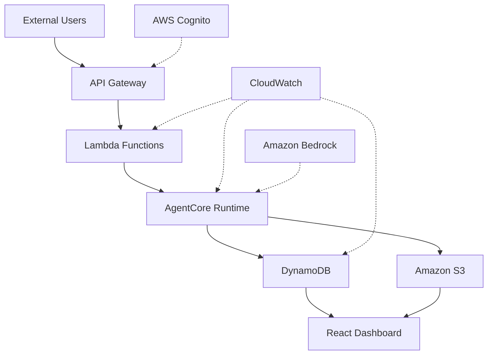

# Architecture Diagram Description

## High-Level Architecture Diagram

This document describes the architecture diagram for InsightModAI Agent, which can be used to generate visual representations using tools like Lucidchart, Draw.io, or generated via code.

## Component Layout

### Top Layer - External Interfaces
```
┌─────────────────────────────────────────────────────────────────┐
│                    External Applications & Users                 │
│  ┌─────────────┐  ┌─────────────┐  ┌─────────────┐              │
│  │   CRM       │  │   Mobile    │  │   Web       │              │
│  │  Systems    │  │   Apps      │  │  Forms      │              │
│  │             │  │             │  │             │              │
│  └─────────────┘  └─────────────┘  └─────────────┘              │
└─────────────────────────────────────────────────────────────────┘
                                │
                                ▼
┌─────────────────────────────────────────────────────────────────┐
│                      API Gateway (REST)                         │
│  ┌─────────────┐  ┌─────────────┐  ┌─────────────┐              │
│  │ POST /feedback│  │ GET /insights│  │ POST /agent  │           │
│  │ (Public)      │  │ (Protected)  │  │ (Protected)  │           │
│  └─────────────┘  └─────────────┘  └─────────────┘              │
└─────────────────────────────────────────────────────────────────┘
```

### Middle Layer - Processing & Storage
```
┌─────────────────────────────────────────────────────────────────┐
│                    AWS Lambda Functions                         │
│  ┌─────────────┐  ┌─────────────┐  ┌─────────────┐              │
│  │ Ingestion   │  │ Agent       │  │ CRM         │              │
│  │ Function    │  │ Invoker     │  │ Integrator  │              │
│  └─────────────┘  └─────────────┘  └─────────────┘              │
└─────────────────────────────────────────────────────────────────┘
                                │
                                ▼
┌─────────────────────────────────────────────────────────────────┐
│                AgentCore Runtime (Containerized)                │
│  ┌─────────────┐  ┌─────────────┐  ┌─────────────┐              │
│  │ Strands     │  │ Bedrock     │  │ Memory      │              │
│  │ Agent       │  │ Claude      │  │ Management  │              │
│  └─────────────┘  └─────────────┘  └─────────────┘              │
└─────────────────────────────────────────────────────────────────┘
                                │
                                ▼
┌─────────────────────────────────────────────────────────────────┐
│                    Storage & Databases                          │
│  ┌─────────────┐  ┌─────────────┐  ┌─────────────┐              │
│  │ DynamoDB    │  │ Amazon S3   │  │ SSM         │              │
│  │ Tables      │  │ Buckets     │  │ Parameters  │              │
│  └─────────────┘  └─────────────┘  └─────────────┘              │
└─────────────────────────────────────────────────────────────────┘
```

### Bottom Layer - Foundation Services
```
┌─────────────────────────────────────────────────────────────────┐
│                    Foundation Services                          │
│  ┌─────────────┐  ┌─────────────┐  ┌─────────────┐              │
│  │ AWS Cognito │  │ CloudWatch  │  │ AWS Amplify │              │
│  │ (Auth)      │  │ (Monitoring)│  │ (Hosting)   │              │
│  └─────────────┘  └─────────────┘  └─────────────┘              │
└─────────────────────────────────────────────────────────────────┘
                                │
                                ▼
┌─────────────────────────────────────────────────────────────────┐
│                    Amazon Bedrock AI                           │
│  ┌─────────────┐  ┌─────────────┐  ┌─────────────┐              │
│  │ Claude 3.5  │  │ Sentiment   │  │ Text        │              │
│  │ Sonnet      │  │ Analysis    │  │ Processing  │              │
└─────────────┘  └─────────────┘  └─────────────┘              │
└─────────────────────────────────────────────────────────────────┘
```

## Data Flow Diagram

### Feedback Processing Flow
```
Customer Feedback
       │
       ▼
API Gateway (POST /feedback)
       │
       ▼
Lambda Ingestion Function
       │
       ▼
DynamoDB (Feedback Storage)
       │
       ▼
AgentCore Runtime Trigger
       │
       ▼
Strands Agent Processing
       ├─► Sentiment Analysis Tool
       ├─► Database Operations Tool
       ├─► Report Generation Tool
       └─► CRM Integration Tool (optional)
       │
       ▼
DynamoDB (Analysis Results)
       │
       ▼
S3 (Generated Reports)
       │
       ▼
React Dashboard (Visualization)
```

### Real-time Monitoring Flow
```
┌─────────────────────────────────────────────────────────────────┐
│                    Real-time Event Streams                      │
│  ┌─────────────┐  ┌─────────────┐  ┌─────────────┐              │
│  │ CloudWatch  │  │ DynamoDB    │  │ S3 Event    │              │
│  │ Logs        │  │ Streams     │  │ Notifications│             │
│  └─────────────┘  └─────────────┘  └─────────────┘              │
└─────────────────────────────────────────────────────────────────┘
                                │
                                ▼
┌─────────────────────────────────────────────────────────────────┐
│                    Dashboard Updates                            │
│  ┌─────────────┐  ┌─────────────┐  ┌─────────────┐              │
│  │ WebSocket   │  │ Real-time   │  │ Live        │              │
│  │ Connections │  │ Charts      │  │ Metrics     │              │
│  └─────────────┘  └─────────────┘  └─────────────┘              │
└─────────────────────────────────────────────────────────────────┘
```

## Security Architecture

### Authentication Flow
```
┌─────────────────────────────────────────────────────────────────┐
│                    Authentication Flow                          │
│  ┌─────────────┐  ┌─────────────┐  ┌─────────────┐              │
│  │ User Login  │  │ Cognito     │  │ JWT Token   │              │
│  │ (Email/PW)  │  │ Validation  │  │ Generation  │              │
│  └─────────────┘  └─────────────┘  └─────────────┘              │
└─────────────────────────────────────────────────────────────────┘
                                │
                                ▼
┌─────────────────────────────────────────────────────────────────┐
│                    Authorization Flow                           │
│  ┌─────────────┐  ┌─────────────┐  ┌─────────────┐              │
│  │ API Gateway │  │ Lambda      │  │ IAM         │              │
│  │ Authorizer  │  │ Authorization│  │ Permissions │             │
│  └─────────────┘  └─────────────┘  └─────────────┘              │
└─────────────────────────────────────────────────────────────────┘
```

### Data Protection Layers
```
┌─────────────────────────────────────────────────────────────────┐
│                    Data Protection                              │
│  ┌─────────────┐  ┌─────────────┐  ┌─────────────┐              │
│  │ Encryption  │  │ Access      │  │ Audit       │              │
│  │ at Rest     │  │ Control     │  │ Logging     │              │
│  │ (KMS)       │  │ (IAM)       │  │ (CloudTrail)│             │
│  └─────────────┘  └─────────────┘  └─────────────┘              │
└─────────────────────────────────────────────────────────────────┘
                                │
                                ▼
┌─────────────────────────────────────────────────────────────────┐
│                    Network Security                             │
│  ┌─────────────┐  ┌─────────────┐  ┌─────────────┐              │
│  │ VPC         │  │ Security    │  │ WAF         │              │
│  │ Endpoints   │  │ Groups      │  │ Protection  │              │
│  └─────────────┘  └─────────────┘  └─────────────┘              │
└─────────────────────────────────────────────────────────────────┘
```

## Color Coding for Diagram

### Component Colors
- **External Systems**: Blue (#2196F3)
- **API Gateway**: Green (#4CAF50)
- **Lambda Functions**: Orange (#FF9800)
- **AgentCore Runtime**: Purple (#9C27B0)
- **DynamoDB**: Red (#F44336)
- **S3**: Yellow (#FFEB3B)
- **Cognito/Amplify**: Teal (#009688)
- **CloudWatch**: Gray (#9E9E9E)
- **Bedrock**: Pink (#E91E63)

### Connection Types
- **Synchronous API Calls**: Solid lines
- **Asynchronous Events**: Dashed lines
- **Streaming Data**: Dotted lines with arrows
- **Authentication**: Double lines

## Visual Elements

### Icons to Use
- **API Gateway**: Gateway icon with arrows
- **Lambda**: Function symbol (ƒ)
- **DynamoDB**: Database cylinder
- **S3**: Bucket/container icon
- **AgentCore**: Brain/AI icon with container
- **Cognito**: Shield/lock icon
- **CloudWatch**: Eye/monitoring icon
- **Bedrock**: Cloud with AI symbol

### Flow Direction
- **Data Flow**: Left to right, top to bottom
- **Control Flow**: Right to left for responses
- **Real-time Updates**: Circular arrows

## Alternative Views

### Cost-Focused View
```
Monthly Costs by Component:
• Lambda: $5-20 (invocations)
• DynamoDB: $1-5 (on-demand)
• S3: $1-2 (storage)
• Bedrock: $10-50 (tokens)
• API Gateway: $3-5 (requests)
• Cognito: Free tier
• Total: $20-82/month
```

### Performance View
```
Response Times:
• API Ingestion: <100ms
• Agent Processing: <30s
• Dashboard Load: <2s
• Report Generation: <10s
• Sentiment Analysis: <5s
```

### Scalability View
```
Auto-scaling Capabilities:
• Lambda: 0-1000+ concurrent executions
• DynamoDB: On-demand with burst capacity
• API Gateway: Automatic throttling
• AgentCore: Container-based scaling
• S3: Unlimited storage
```

## Generation Instructions

### Using Lucidchart/Draw.io
1. Create a new diagram with AWS architecture template
2. Add components in the layout described above
3. Use the color coding specified
4. Connect components with appropriate line styles
5. Add data flow labels on connections

### Using Code Generation
The architecture can be generated using:
- **PlantUML**: For text-based diagram generation
- **Mermaid**: For markdown-embedded diagrams
- **Graphviz**: For automated layout generation

### Mermaid Example


## Key Architectural Principles

1. **Serverless First**: All compute is serverless (Lambda, AgentCore Runtime)
2. **Event-Driven**: Asynchronous processing with event triggers
3. **Modular Design**: Each component has single responsibility
4. **Security by Design**: Least-privilege access, encryption everywhere
5. **Observability**: Comprehensive monitoring and logging
6. **Scalability**: Automatic scaling based on demand
7. **Cost Optimization**: Pay-per-use with intelligent tiering

This architecture provides a robust, scalable, and cost-effective solution for autonomous customer insights analysis while maintaining enterprise-grade security and reliability.
